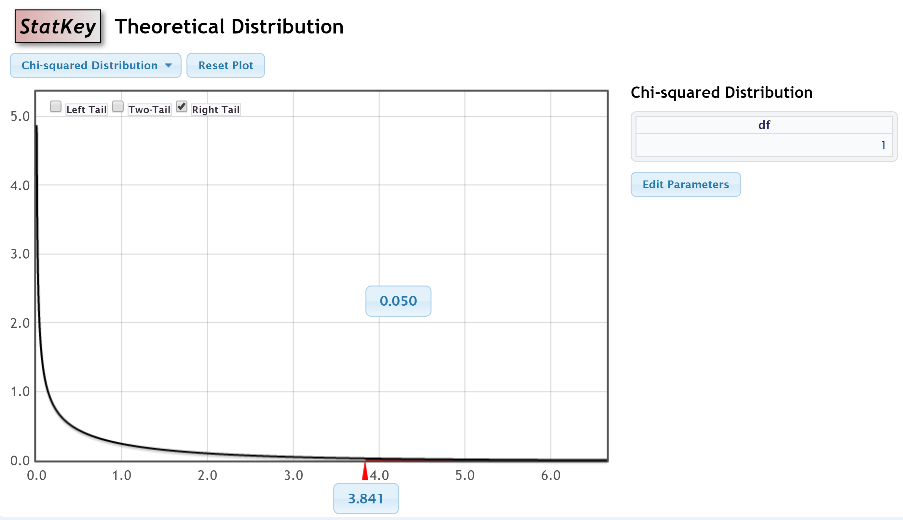
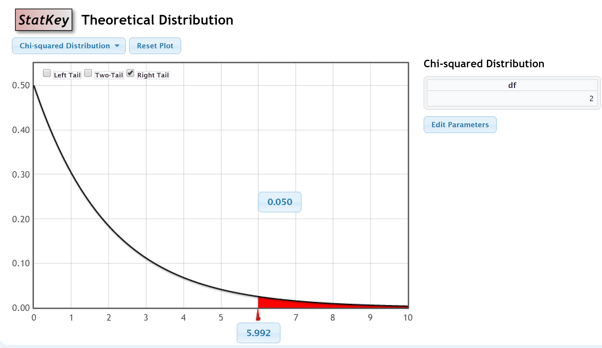

```{r setup, eval=TRUE, include=FALSE}  
knitr::opts_chunk$set( comment=NA, eval=TRUE,  echo=TRUE, warning=FALSE, message=FALSE, error=FALSE, root.dir = "C:/Users/ekene/Documents/eH705_Project") 
pacman::p_load(psych, ggplot2, DT, sjPlot, knitr, DescTools,
               ggcorrplot, qgraph, corrr, tidyverse, Hmisc )
```

```{r echo=FALSE}
# include this code chunk as-is to set options
knitr::opts_chunk$set(comment=NA, prompt=TRUE, out.width=750, fig.height=8, fig.width=8)
library(Rcmdr)
library(car)
library(RcmdrMisc)
```


```{r echo=FALSE}
# include this code chunk as-is to enable 3D graphs
library(rgl)
knitr::knit_hooks$set(webgl = hook_webgl)
```

# Statement of Authorship
This report is created by Ekene Olatunji, Catherine Nassralla, Victoria Chin, Bassam Chamas, and Sajiya Somji for the eHealth 705 Statistics in eHealth final project.

# Executive Summary 

Using the principles taught during the eHealth 705 course, the ICU Admissions dataset was explored, analyzed and a logistic regression model was created. Logistic regression was used to create a model as the response variable, Status, was categorical, as were several of the predictor variables in this dataset. Using graphs, descriptive statistics and summaries, the attributes were analyzed and recoded if needed, as well as interpreted. (include reasons why we did tests, summary of what was found. )
- overview of tests that we performed and some of the results
- maybe include why we chose some of the tests
- since the main predictor variable was vital status, most of the analyses and exploration was about this variable

# About the ICU Admissions Dataset
The ICU Admissions Dataset was obtained 

## Description 

The ICU Admission dataset contains observations of patients that were admitted to an adult intensive care unit (ICU). The response variable of this dataset is Status of patients after admission, that is, whether they lived or died after admission to ICU. A description of the variables is available below.

Number of cases: 200 
Variable Names: 

  1.	ID: ID number of the patient 
  2.	STA: Vital status (0 = Lived, 1 = Died) 
  3.	AGE: Patient's age in years 
  4.	SEX: Patient's sex (0 = Male, 1 = Female) 
  5.	RACE: Patient's race (1 = White, 2 = Black, 3 = Other) 
  6.	SER: Service at ICU admission (0 = Medical, 1 = Surgical) 
  7.	CAN: Is cancer part of the present problem? (0 = No, 1 = Yes) 
  8.	CRN: History of chronic renal failure (0 = No, 1 = Yes) 
  9.	INF: Infection probable at ICU admission (0 = No, 1 = Yes) 
  10.	CPR: CPR prior to ICU admission (0 = No, 1 = Yes) 
  11.	SYS: Systolic blood pressure at ICU admission (in mm Hg) 
  12.	HRA: Heart rate at ICU admission (beats/min) 
  13.	PRE: Previous admission to an ICU within 6 months (0 = No, 1 = Yes) 
  14.	TYP: Type of admission (0 = Elective, 1 = Emergency) 
  15.	FRA: Long bone, multiple, neck, single area, or hip fracture (0 = No, 1 = Yes) 
  16.	PO2: PO2 from initial blood gases (0 = >60, 1 = ²60) 
  17.	PH: PH from initial blood gases (0 = ³7.25, 1 <7.25) 
  18.	PCO: PCO2 from initial blood gases (0 = ²45, 1 = >45) 
  19.	BIC: Bicarbonate from initial blood gases (0 = ³18, 1 = <18) 
  20.	CRE: Creatinine from initial blood gases (0 = ²2.0, 1 = >2.0) 
  21.	LOC: Level of consciousness at admission (0 = no coma or stupor, 1= deep stupor, 2 = coma) 

# Reading in the ICU Admissions Dataset
```{r}
ICU <- read.table("./ICUAdmissions.csv", header=TRUE, sep=",", na.strings="NA", dec=".", strip.white=TRUE)
```


## Structure of the ICU dataset  

```{r}
str(ICU)
```

The ICU Admissions dataset consists of 200 observations with 21 variables. From these observations we found;

  1. The dependent variable is the binary variable Vital Status (Status).   
  2. Nineteen possible predictor variables, both discrete and continuous, were also observed. 
  3. Most of the variables are integer but from information about the data, most of the variables can be recoded to factor variables. Several of the variables have two to three levels categories and so while they are numerical, their means do not offer any meaningful information. 
  4. There are only four variables that can be left as numerical variables others can be recoded to categorical/factor variables.  
  5. There would be a need to recode the categorical variables to factors.  
  6. There are no missing data.  
  

# Converting Numerical Variables to Factor Variables

Attributes that could be recoded as factors included Status, Sex, Race, Service, Cancer, Renal, Infection, CPR, Previous, Type, Fracture, PCO2, PH, PO2, Bicarbonate, Creatinine and Consciousness. Labelling the factor levels with level names helps with comparative analysis and visualization. 

```{r}
ICU <- within(ICU, {
  Status <- factor(Status, labels=c('Lived','Died'))
  Sex <- factor(Sex, labels=c('Male','Female'))
  Race <- factor(Race, labels=c('White','Black','Other'))
  Service <- factor(Service, labels=c('Medical','Surgical'))
  Cancer <- factor(Cancer, labels=c('No','Yes'))
  Renal <- factor(Renal, labels=c('No','Yes'))
  Infection <- factor(Infection, labels=c('No','Yes'))
  CPR <- factor(CPR, labels=c('No','Yes'))
  Previous <- factor(Previous, labels=c('No','Yes'))
  Type <- factor(Type, labels=c('Elective','Emergency'))
  Fracture <- factor(Fracture, labels=c('No','Yes'))
  PCO2 <- factor(PCO2, labels=c('No','Yes'))
  PH <- factor(PH, labels=c('No','Yes'))
  PO2 <- factor(PO2, labels=c('No','Yes'))
  Bicarbonate <- factor(Bicarbonate, labels=c('No','Yes'))
  Creatinine <- factor(Creatinine, labels=c('No','Yes'))
  Consciousness <- factor(Consciousness, labels=c('Conscious','Deep Stupor','Coma'))
})
```

## Preview of Recoded Dataset
```{r}
headTail(ICU) %>% datatable(rownames = TRUE, filter="top", options = list(pageLenght = 10, scrollX=T))%>% formatRound(columns=c(1:17), digits=0)
```

## Saving Recoded Dataset
```{r}
# write.csv(ICU, file="ICUAdmissions_recoded.csv", row.names=FALSE)
```

# Data Exploration - Statistical summaries and Graphing of variables

## Viewing a few rows of the recorded dataset

```{r}
headTail(ICU) %>% datatable(rownames = TRUE, filter="top", options = list(pageLenght = 10, scrollX=T))%>% formatRound(columns=c(1:17), digits=0)
```

```{r}
str(ICU)
```

**Findings**  

* The following variables were successfully recoded; Status, Sex, Race, Service, Cancer, Renal, Infection, CPR, Previous, Type,Fracture, PCO2,PH, PO2, Bicarbonate, Creatinine, and Consciousness. 

## Statistical Summary of the Recoded Dataset
```{r}
summary(ICU)
```


## Numerical Summary of Integer Variables
```{r}
numSummary(ICU[,c("Age", "HeartRate", "Systolic"), drop=FALSE], statistics=c("mean", "sd", "IQR", 
  "quantiles"), quantiles=c(0,.25,.5,.75,1))
```

**Findings**

* Age ranges from 16-92 years old with a mean of 57.55 and median of 63
* Systolic blood pressure ranges from 36-256 mmHg with a mean of 132.3 and median of 130
* Heart rate ranges from 39-192 beats per minute with a mean of 98.92 and median of 96

# Data Exploration - Graphs

## Examining the Variables Distribution

```{r echo=FALSE}
xray:: distributions(ICU)
```

Using the xray package, general trends in the dataset were identified. 

1) There are more male observations in the dataset than females.

2) Many of the admissions to the ICU were emergencies, with a about a quarter of admissions being elective. This could relate to elective surgical procedures where morbidity could have been high or complications occurred. It is unclear whether people would be preemptively admitted to the ICU for high-risk procedures or if these elective admissions could be thought of as unforeseen or emergencies in themselves.

3) Looking at Status, more than 75% of observations lived after their ICU admission. 

4) While the numbers are roughly even, slightly more procedures were surgical. 

5) More admitted patients had no chronic renal failure, previous admissions to the ICU, fracture, CPR or cancer when admitted. Most admitted patients had  PO2 above or equal to 60, blood pH above or equal to 7.25, PCO2 below or equal to 45, and creatinine below or equal to 2.

6) Most patients admitted were conscious, with slighly more patients being comatose than in a deep stupor if unconscious. 

7) Looking at histograms of the three numerical variables in the dataset, which were Age, Systolic and HeartRate, it could be guess that if any of the distributions were to be normal, they would be Systolic and HeartRate. Age is very obviously not normally distributed. Systolic looks like it is centered around 140, and the mean confirms this as mentioned above. The mean of HeartRate seems to be centered around 100 and its mean confirms this visual estimate. 


## Distribution of Vital Status by Factor Variables
```{r}
library(ggplot2)
f01<-ggplot(ICU, aes(x=Sex, fill = Status)) +
 theme_bw() +
 geom_bar() +
 labs(y = "Patient Count",
      title = "Vital Status by Sex")

f02<-ggplot(ICU, aes(x=Race, fill = Status)) +
 theme_bw() +
 geom_bar() +
 labs(y = "Patient Count",
      title = "Vital Status by Race")
f03<-ggplot(ICU, aes(x=Service, fill = Status)) +
 theme_bw() +
 geom_bar() +
 labs(y = "Patient Count",
      title = "Vital Status by Service")

f04<-ggplot(ICU, aes(x=Cancer, fill = Status)) +
 theme_bw() +
 geom_bar() +
 labs(y = "Patient Count",
      title = "Vital Status by Cancer")

library(Rmisc)
multiplot(f01, f02, f03, f04,  layout=matrix(c(1:4), nrow=2, byrow=TRUE))
```

```{r}

f05<-ggplot(ICU, aes(x=Renal, fill = Status)) +
 theme_bw() +
 geom_bar() +
 labs(y = "Patient Count",
      title = "Vital Status by Renal")

f06<-ggplot(ICU, aes(x=Infection, fill = Status)) +
 theme_bw() +
 geom_bar() +
 labs(y = "Patient Count",
      title = "Vital Status by Infection")

f07<-ggplot(ICU, aes(x=CPR, fill = Status)) +
 theme_bw() +
 geom_bar() +
 labs(y = "Patient Count",
      title = "Vital Status by CPR")

f08<-ggplot(ICU, aes(x=Previous, fill = Status)) +
 theme_bw() +
 geom_bar() +
 labs(y = "Patient Count",
      title = "Vital Status by Previous")

library(Rmisc)
multiplot(f05, f06, f07, f08,  layout=matrix(c(1:4), nrow=2, byrow=TRUE))
``` 

```{r}

f09<-ggplot(ICU, aes(x=Type, fill = Status)) +
 theme_bw() +
 geom_bar() +
 labs(y = "Patient Count",
      title = "Vital Status by Type")

f10<-ggplot(ICU, aes(x=Fracture, fill = Status)) +
 theme_bw() +
 geom_bar() +
 labs(y = "Patient Count",
      title = "Vital Status by Fracture")

f11<-ggplot(ICU, aes(x=PO2, fill = Status)) +
 theme_bw() +
 geom_bar() +
 labs(y = "Patient Count",
      title = "Vital Status by PO2")

f12<-ggplot(ICU, aes(x=PH, fill = Status)) +
 theme_bw() +
 geom_bar() +
 labs(y = "Patient Count",
      title = "Vital Status by PH")

library(Rmisc)
multiplot(f09, f10, f11, f12,  layout=matrix(c(1:4), nrow=2, byrow=TRUE))
```

```{r}
f13<-ggplot(ICU, aes(x=PCO2, fill = Status)) +
 theme_bw() +
 geom_bar() +
 labs(y = "Patient Count",
      title = "Vital Status by PCO2")

f14<-ggplot(ICU, aes(x=Bicarbonate, fill = Status)) +
 theme_bw() +
 geom_bar() +
 labs(y = "Patient Count",
      title = "Vital Status by Bicarbonate")

f15<-ggplot(ICU, aes(x=Creatinine, fill = Status)) +
 theme_bw() +
 geom_bar() +
 labs(y = "Patient Count",
      title = "Vital Status by Creatinine")

f16<-ggplot(ICU, aes(x=Consciousness, fill = Status)) +
 theme_bw() +
 geom_bar() +
 labs(y = "Patient Count",
      title = "Vital Status by Consciousness")


library(Rmisc)
multiplot(f13, f14, f15, f16, layout=matrix(c(1:4), nrow=2, byrow=TRUE))
```

## Plotting the density Distribution of the Numeric Variables

```{r}
d01 <- ggplot(ICU, aes(x=Age)) +
 geom_density(fill="green") +
 ggtitle("Age") +
 theme(axis.title.x=element_text(size=16, face="bold", colour="blue")) +
 theme(axis.text.x=element_text(size=14 )) +
 annotate("text", x=0.8, y=-0.001, label="Base=315",  size=4)

d02 <- ggplot(ICU, aes(x=Systolic)) +
 geom_density(fill="green") +
 ggtitle("Systolic") +
 theme(axis.title.x=element_text(size=16, face="bold", colour="blue")) +
 theme(axis.text.x=element_text(size=14 )) +
 annotate("text", x=0.8, y=-0.001, label="Base=315",  size=4)

d03 <- ggplot(ICU, aes(x=HeartRate)) +
 geom_density(fill="green") +
 ggtitle("HeartRate") +
 theme(axis.title.x=element_text(size=16, face="bold", colour="blue")) +
 theme(axis.text.x=element_text(size=14 )) +
 annotate("text", x=0.8, y=-0.001, label="Base=315",  size=4)

d04 <- ggplot(ICU, aes(x=ID)) +
 geom_density(fill="green") +
 ggtitle("ID") +
 theme(axis.title.x=element_text(size=16, face="bold", colour="blue")) +
 theme(axis.text.x=element_text(size=14 )) +
 annotate("text", x=0.8, y=-0.001, label="Base=315",  size=4)

multiplot(d01, d02, d03, d04, layout=matrix(c(1:4), nrow=2, byrow=TRUE))

```


## Density Plot of Vital Status by Numeric Variables 
```{r}
n01<-ggplot(ICU, aes(x=Age, fill = Status)) +
  theme_bw() +
      geom_density(alpha=0.5) +
  labs(y = "Density",
       title = "Distribution of Vital Status by Age")

n02<-ggplot(ICU, aes(x=Systolic, fill = Status)) +
  theme_bw() +
      geom_density(alpha=0.5) +
  labs(y = "Density",
       title = "Distribution of Vital Status by Systolic")

n03<-ggplot(ICU, aes(x=HeartRate, fill = Status)) +
  theme_bw() +
      geom_density(alpha=0.5) +
  labs(y = "Density",
       title = "Distribution of Vital Status by HR")

n04<-ggplot(ICU, aes(x=Age, fill = Status)) +
  theme_bw() +
  facet_wrap(~ Sex) +
      geom_density(alpha=0.5) +
  labs(y = "Density",
       title = "Density distribution of Vital Status in male and female patients by Age")

multiplot(n01, n02, n03, n04, layout=matrix(c(1:4), nrow=2, byrow=TRUE))
```

## Observations

  - ***There are more male than female in the population.
  - The number of patient who live is higher than the population who died
  - More Patients from the population aged 50 and above died in both male and female
  - The female population experienced more death than men of the same age bracket as 
  - ****The density plot is peaked at the top at the age 75 for both male and female meaning more patients aged 75 died.

# Catherine
## Relationships with Age 

The mean of Age, referring to the descriptive statistics for this attributes, is about 58 years. Visually, it can be seen that the distribution of Age has two peaks, one around 20 years of age and one around 70 years of age. The majority of subjects admitted to the ICU seem to be between 40-80 years old. 

```{r}
ggplot(ICU, aes(x=Age)) +
 geom_density(fill="green") +
 ggtitle("Age") +
 theme(axis.title.x=element_text(size=16, face="bold", colour="blue")) +
 theme(axis.text.x=element_text(size=14 )) +
 annotate("text", x=0.8, y=-0.001, label="Base=315",  size=4)
```

Overlaying Status and Age, density plots show that deaths after admission follow the larger Age peak that contains middle aged to elderly individuals. 

```{r}
ggplot(ICU, aes(x=Age, fill = Status)) +
  theme_bw() +
      geom_density(alpha=0.5) +
  labs(y = "Density",
       title = "Density distribution of Vital Status by Age")
```

While the plot of Age and death follow the same pattern for older individuals, the association between Cancer and Age is less clear. There are three peaks for of Ages where ICU admissions involved cancer. These are around 20, 50 and 70 years of age. Given the relatively small number of individuals who had cancer involvement with their admission, and the variability in ages associated, cancer might not be the best predictor of ICU admission. 

```{r}
ggplot(ICU, aes(x=Age, fill = Cancer)) +
  theme_bw() +
      geom_density(alpha=0.5) +
  labs(y = "Density",
       title = "Density distribution of Cancer by Age")
```

ICU admissions that involved infection centered around 60-65 years of age. This associations is relatively clear visually looking at the plot below. 

```{r}
ggplot(ICU, aes(x=Age, fill = Infection )) +
  theme_bw() +
      geom_density(alpha=0.5) +
  labs(y = "Density",
       title = "Density distribution of Infection by Age")
```


Another association that was explored was between Age and Consiousness. All three categories for Consciousness overlap with peaks between 50 and 75 years of age. There is a distinct peak at around 50 for deep stupor, indicating that this age might be associated with deep stupor when related to ICU admissions. However, deep stupor also has a secondary peak at around 75, which make it less clearly how this consciousness category relates to age in this dataset. 

```{r}
ggplot(ICU, aes(x=Age, fill = Consciousness )) +
  theme_bw() +
      geom_density(alpha=0.5) +
  labs(y = "Density",
       title = "Density distribution of Consciousness by Age")
```

Both admission Types, elective and emergency, happen more frequently with advancing age. However, elective admissions happen more frequently with older age. This might suggest that older individuals are more likely to have complications during surgical or other procedures that would require admissions to an intensive care unit. 

```{r}
ggplot(ICU, aes(x=Age, fill = Type )) +
  theme_bw() +
      geom_density(alpha=0.5) +
  labs(y = "Density",
       title = "Density distribution of Type by Age")
```

## Relationships with HeartRate

Using a density estimate plot, the distribution of HeartRate was produced. The main peak here is at about 90 beats per minute. There appears to be secondary peak around 130 beats per minute. The mean for HeartRate calculated by Rcmdr is 99. Looking at the data, this mean might be said to not accurately portray the frequency of values for HearRate. 

```{r}
 ggplot(ICU, aes(x=HeartRate)) +
 geom_density(fill="green") +
 ggtitle("HeartRate") +
 theme(axis.title.x=element_text(size=16, face="bold", colour="blue")) +
 theme(axis.text.x=element_text(size=14 )) +
 annotate("text", x=0.8, y=-0.001, label="Base=315",  size=4)
```
Both status categories have similar peaks when plotted on a density estimate plot of HeartRate. This indicates that there might not be a difference in the Status response category based on HeartRate. People who lived did seem to have a higher density of HeartRate values around 90 than those who died. A normal adult heart rate rangest between 60 and 100 beats per minute. This graph might suggest that people who lived more often had heartrates within this range, whereas those who died seemed more likely to have higher heartrates. This could inform further analysis or research. 

```{r}
ggplot(ICU, aes(x=HeartRate, fill = Status)) +
  theme_bw() +
      geom_density(alpha=0.5) +
  labs(y = "Density",
       title = "Density distribution of Vital Status HeartRate")
```

## Relationships with Systolic

Below is a density plot of Systolic blood pressure in mmHg. A peak appears around 130-140mmHg. The peak is quite narrow and distinct compared to the density plots of Age and HeartRate, suggesting that the majority of individuals had blood pressure readings that are reflective of this plot. The mean for this attribute was 132mmHg, which seems to be more valid than the means of the other numeric variables, based on the distribution of the frequency of values. 

```{r}
ggplot(ICU, aes(x=Systolic)) +
 geom_density(fill="green") +
 ggtitle("Systolic") +
 theme(axis.title.x=element_text(size=16, face="bold", colour="blue")) +
 theme(axis.text.x=element_text(size=14 )) +
 annotate("text", x=0.8, y=-0.001, label="Base=315",  size=4)
```

The distribution of Systolic values for those who died seem to be concentrated around 75 mmHg and 140mmHg. A normal Systolic blood pressure can vary widely but the American Heart Association states that blood pressure below 120mmHg is normal. However, excessively low blood pressure could be a result of bleeding, for example, and can result in insufficient blood flow to critical organs. Medications used to restore blood pressure are used when blood pressure becomes too low. This might explain the peak around 75mmHg in the death curve in the graph below. 

```{r}
ggplot(ICU, aes(x=Systolic, fill = Status)) +
  theme_bw() +
      geom_density(alpha=0.5) +
  labs(y = "Density",
       title = "Density distribution of Vital Status Systolic")
```

# Uniform Distribution   

The distribution of the ICU attributes will be explored below. Many of the attributes chosen to be tested here relate to the history of the individuals in the data set or the circumstances of the admission, rather than lab tests on admission. It would be interesting to explore  Most of the categorical attributes in this dataset have two categories, making the degrees of freedom 1 for chi squared distribution. 

```{r echo=FALSE, fig.cap= "Theoretical chi square distribution with 1 degrees of freedom", out.width="70%" }

```
For Categorical variables with two categories:    
_H0_: the attribute is distributed uniformally, the chi squared value does not exceed the hypothesized  value of 3.841 (p = 0.05)    
_Ha_: the attribute is not distiributed uniformally, The chi squared value exceeds the hypothesized value of 3.841    

Chi squared test - Status:  

The chi squared test for Status returns a chi squared value above the null hypothesized value with a very small p value (<0.05), indicating that there is a very low risk of Type I error if the null hypothesis is rejected. It can be concluded that Status is not uniformally distributed and that statistically more individuals lived than died on admission to the ICU.  

```{r}
local({
  .Table <- with(ICU, table(Status))
  cat("\ncounts:\n")
  print(.Table)
  cat("\npercentages:\n")
  print(round(100*.Table/sum(.Table), 
  2))
  .Probs <- c(0.5,0.5) 
  chisq.test(.Table, p=.Probs)
})
```

Chi squared test - CPR:   

Similarly, the chi squared test for CPR returns a very high chi squared value at 151, and a low p value, allowing us to reject the null hypothesis that this attribute is uniformally distributed. More individuals did not have CPR than did before ICU admission. In fact, as seen from the table below, few individuals received CPR at all, which might make it a poor predictor of ICU outcomes.

```{r}
local({
  .Table <- with(ICU, table(CPR))
  cat("\ncounts:\n")
  print(.Table)
  cat("\npercentages:\n")
  print(round(100*.Table/sum(.Table), 
  2))
  .Probs <- c(0.5,0.5) 
  chisq.test(.Table, p=.Probs)
})
```

```{r}
table(ICU$CPR, ICU$Status)
```

Chi squared test - Infection:   

The chi squared value produced from this test is only slightly higher than the null hypothesized value, with a p value of 0.024, indicating a 2.4% chance of a Type I error if the null hypothesis is rejected. While the distribution can be concluded to not be uniform based on the threshold set with the null hypothesis, the uniformity of Infection among patients admitted to the ICU could be explored in further research. It should be noted that in the group of individuals who died, more had infections than not. 

```{r}
local({
  .Table <- with(ICU, table(Infection))
  cat("\ncounts:\n")
  print(.Table)
  cat("\npercentages:\n")
  print(round(100*.Table/sum(.Table), 
  2))
  .Probs <- c(0.5,0.5) 
  chisq.test(.Table, p=.Probs)
})
```

```{r}
table(ICU$Infection, ICU$Status)
```

Chi squared test - Previous:   

The chi squared value here exceeds the null hypothesized value with a p value much smaller than 0.05, allowing us to reject the null hypothesis that this attribute is uniformally distributed. More individuals in both status categories did not have a previous ICU admission. 

```{r}
local({
  .Table <- with(ICU, table(Previous))
  cat("\ncounts:\n")
  print(.Table)
  cat("\npercentages:\n")
  print(round(100*.Table/sum(.Table), 
  2))
  .Probs <- c(0.5,0.5) 
  chisq.test(.Table, p=.Probs)
})
```

Chi squared test - Sex:   

The chi squared value returned from this test is 11.52, which is not as far from the null hypothesized value as some of the other values generated from other tests. The value and p value of 0.00069 still indicated that the null hypothesis should be reject and that Sex is not uniformally distributed. There are more men in this dataset than females. 
```{r}
local({
  .Table <- with(ICU, table(Sex))
  cat("\ncounts:\n")
  print(.Table)
  cat("\npercentages:\n")
  print(round(100*.Table/sum(.Table), 
  2))
  .Probs <- c(0.5,0.5) 
  chisq.test(.Table, p=.Probs)
})
```
In both sex categories, despite the inequality in the number of observations in each group, there are still more individuals who lived than died. 
```{r}
with(ICU, Barplot(Sex, by=Status, 
  style="divided", legend.pos="above", 
  xlab="Sex", ylab="Frequency"))
```

Chi squared test - Type:

The distribution of Type can be concluded to be non-uniform as the null hypothesis should be rejected based on the chi squared value produced and low p value. As seen in exploratory data analysis, the there are more individuals who are had emergency admissions than elective admissions. This difference in distribution is statistically significant. Fewer individuals died when they were admitted to the ICU on an elective basis.

```{r}
local({
  .Table <- with(ICU, table(Type))
  cat("\ncounts:\n")
  print(.Table)
  cat("\npercentages:\n")
  print(round(100*.Table/sum(.Table), 
  2))
  .Probs <- c(0.5,0.5) 
  chisq.test(.Table, p=.Probs)
})
```

```{r}
with(ICU, Barplot(Type, by=Status, 
  style="divided", legend.pos="above", 
  xlab="Type", ylab="Frequency"))
```

For Categorical variables with three categories:    
_Ho_: the attribute is distributed uniformally, the chi squared value does not exceed the hypothesized  value of 5.992 (p = 0.05)    
_Ha_: the attribute is not distiributed uniformally, The chi squared value exceeds the hypothesized value of 5.992 (p=0.05)    

```{r echo=FALSE, fig.cap= "Theoretical chi square distribution with 2 degrees of freedom", out.width="70%" }

```

Chi squared test - Consciousness

The null hypothesis for this attribute's distribution is that an equal number of observations will be found in each category of Consciousness. The chi squared value produced by this test exceeds the null hypothesized value with a low p value, indicating that the observations in this category are statistically not uniform. This could have been guessed from counts of observations in each category, where most individuals were in the conscious category. 
```{r}
local({
  .Table <- with(ICU, 
  table(Consciousness))
  cat("\ncounts:\n")
  print(.Table)
  cat("\npercentages:\n")
  print(round(100*.Table/sum(.Table), 
  2))
  .Probs <- c(0.333333333333333,
  0.333333333333333,0.333333333333333) 
  chisq.test(.Table, p=.Probs)
})
```

## Normal Distribution

Distribution of the three numerical variables in the ICU dataset was evaluated using quantile-quantile plots and the Shapiro-Wilk's test for normality. Confidence intervals will be produced for the means of each attribute.  

_H0_: Age, HeartRate and Systolic are normally distributed   
_Ha_: Age, HeartRate and Systolic are not normally distributed 

Tests of normality - Age:     

Recall that a quantile-quantile plot should produce a nearly linear plot using dataset values, with the intercept going through zero, if the null hypothesis is satisfied. Below, the plotted points of Age do not conform well to the line of best fit, and are frequently outside of the confidence bands. This supports what might have been hypothesized when the histogram of Age was produced: this distribution is not clearly centered around a mean. This plot suggests that the null hypothesis that Age is normally distributed should be rejected. 
```{r}
with(ICU, qqPlot(Age, dist="norm", id=list(method="y", n=2, labels=rownames(ICU)), main="QQ plot of Age"))
```

Using the Shapiro-Wilk normality test, the conclusions drawn from the QQ plot can be supported, with a very low risk of Type I error, base on this p value. The Shapiro Wilk test is sensitive when used on larger datasets, so this result should be taken into account with the other tests used. 

```{r}
normalityTest(~Age, test="shapiro.test", data=ICU)
```

Using the t-test, given the confidence interval for this attribute is between 54.75 and 60.34, an interval that does not contain 0. (choosing not to add this as I do not have a test mean - need to refresh on what a true mean is )

Tests of normality - HeartRate: 

The QQ plot of HeartRate appears to adhere well to the line of best fit, despite several points in the middle of the graph lying along one side of the confidence band. Most of the points here fall within the confidence band. There is a positive skew of this data towards the lower values of HeartRate. Visually, one might conclude that this data is normally distributed. 
```{r}
with(ICU, qqPlot(HeartRate, dist="norm", id=list(method="y", n=2, labels=rownames(ICU)), main="QQ plot of HeartRate"))
```
The results of the Shapiro-Wilk test very narrowly allow one to reject the null hypothesis of normal distribution. However the p value is very close to the threshold p value of 0.05, which decreases the confidence that might be had to reject normality based on this test and the sample size used. 
```{r}
normalityTest(~HeartRate, test="shapiro.test", data=ICU)
```

Test of normality - Systolic:

Similar to the plot of HeartRate, the QQ plot of Systolic displays points that line closely on the line of best fit. The confidence bands here are quite narrow, and it is only along the ends oof the plot the points very clearly exit the confidence bands. One might conclude that the null hypothesis could be rejected for the normal distribution of Systolic based on this plot. There is a very slight negative skew here towards higher values of Systolic.   
```{r}
with(ICU, qqPlot(Systolic, dist="norm", id=list(method="y", n=2, labels=rownames(ICU)), main="QQ Plot of Systolic"))
```
While more statistically significant compared to the Shapiro Wilk test for normality of the HeartRate distribution, the p value here is not far from 0.05, indicating a 2% risk of Type I error. Based on this test, the null hypothesis could be rejected. The distribution of Systolic appears to be non-normal. 
```{r}
normalityTest(~Systolic, test="shapiro.test", data=ICU)
```

In reference to Ian Fellows' comments about tests for normality, these tests for normality do not add much more to understanding of the ICU dataset and the contributions of these three numerical variables to the determination of Status, beyond what is provided by the xray package. In the same vein, as the central limit theorem and bootstrapping have shown, most distributions can become normal with repeated sampling.

# Victoria
# Differences in Means

## Summary Statistics 

```{r}
numSummary(ICU[,c("Age", "Systolic", "HeartRate"), drop=FALSE], groups=ICU$Status, statistics=c("mean", "sd", "se(mean)"),quantiles=c(0,.25, .5, .75,1))
```

```{r}
library(psych)
describeBy(ICU, ICU$Status)
```

## Age by Status
__Ho:__ the variances for Lived and Died are equal  
__Ha:__ the variances are different

__Ho:__ the means are equal  
__Ha:__ the means are different

The following is the comparison of variances between the two Status groups for Age.

```{r}
with(ICU, tapply(Age, Status, var, na.rm=TRUE))
```

The following code produces the result of the LeveneTest for testing homogeneity of variances.

```{r}
leveneTest(Age ~ Status, data=ICU, center="median")
```

Since the p value = 0.07855 for testing the homogeneity of variances is greater than 0.05, we retain the null hypothesis with a 5% risk of a type 1 error and conclude that the variances for Lived and Died are equal. As such, the Student t-test is used to analyze whether there was a significant difference in means.


```{r}
t.test(Age~Status, alternative='two.sided', conf.level=.95, var.equal=TRUE, data=ICU)
qt(c(0.025), df=314, lower.tail=TRUE)
```

As the p-value = 0.007211, 0 is not within the confidence intervals of -16.35688 to -2.59312 and t = -2.7151 is less than -1.967548, we reject the null hypothesis and conclude that the means for Age for the groups Lived and Died are not the same. 


## HeartRate by Status
__Ho:__ the variances for Lived and Died are equal  
__Ha:__ the variances are different

__Ho:__ the means are equal  
__Ha:__ the means are different

The following is the comparison of variances between the two Status groups for HeartRate.
```{r}
with(ICU, tapply(HeartRate, Status, var, na.rm=TRUE))
```

The following code produces the result of the LeveneTest for testing homogeneity of variances.
```{r}
leveneTest(HeartRate ~ Status, data=ICU, center="median")
```

Since the p-value = 0.929 for testing the homogeneity of variances is greater than 0.05, we retain the null hypothesis with a 5% risk of a type 1 error and conclude that the variances for Lived and Died are equal. As such, the Student t-test is used to analyze whether there was a significant difference in means.

```{r}
t.test(HeartRate~Status, alternative='two.sided', conf.level=.95, var.equal=TRUE, data=ICU)
qt(c(0.025), df=314, lower.tail=TRUE)
```

As the p-value = 0.6553, 0 is within the confidence intervals of -11.496845 to 7.246845 and t = -0.44714 is greater than -1.967548, we retain the null hypothesis at a 5% risk level of a type 1 error and conclude that the means for HeartRate are the same among those that lived and those that died. 

## Systolic by Status
__Ho:__ the variances for Lived and Died are equal  
__Ha:__ the variances are different  

__Ho:__ the means are equal  
__Ha:__ the means are different

The following is the comparison of variances between the two Status groups for Systolic.
```{r}
with(ICU, tapply(Systolic, Status, var, na.rm=TRUE))
```

The following code produces the result of the LeveneTest for testing homogeneity of variances.
```{r}
leveneTest(Systolic ~ Status, data=ICU, center="median")
```

Since the p-value = 0.04205 for testing the homogeneity of variances is less than 0.05, we reject the null hypothesis with a 5% risk of a type 1 error and conclude that the variances for Lived and Died are not equal. As such, the Welch two Sample t-test is used to analyze whether there was a significant difference in means. 

```{r}
t.test(Systolic~Status, alternative="two.sided", conf.level=.95, var.equal=FALSE, data=ICU)
qt(c(0.025), df=314, lower.tail=TRUE)
```

As the p-value = 0.01856, 0 is not within the confidence intervals of  2.938642 to 30.698858 and t = 2.4341 is greater than 1.9675, we reject the null hypothesis at a 5% risk level of a type 1 error and conclude that the means for systolic blood pressure are not the same among those that lived and those that died. 


## Age by Sex
__Ho:__ the variances for Lived and Died are equal  
__Ha:__ the variances are different

__Ho:__ the means are equal  
__Ha:__ the means are different

The following is the comparison of variances between the two Sex groups for Age.

```{r}
with(ICU, tapply(Age, Sex, var, na.rm=TRUE))
```

The following code produces the result of the LeveneTest for testing homogeneity of variances.
```{r}
leveneTest(Age ~ Sex, data=ICU, center="median")
```

Since the p-value = 0.7344 for testing the homogeneity of variances is greater than 0.05, we retain the null hypothesis with a 5% risk of a type 1 error and conclude that the variances for Lived and Died are equal. As such, the Student t-test is used to analyze whether there was a significant difference in means.

```{r}
t.test(Age~Sex, alternative='two.sided', conf.level=.95, var.equal=TRUE, data=ICU)
qt(c(0.025), df=314, lower.tail=TRUE)
```

As the p-value = 0.1759, 0 is within the confidence intervals of -9.708824 to 1.789469 and t = -1.3582 is greater than - 1.9675, we retain the null hypothesis at a 5% risk level of a type 1 error and conclude that the means for systolic blood pressure are the same between the two groups.

# Sajiya
# Difference in proportions

We will conduct z-tests between two categorical variables where the dependent variable is Vital status and the independent variable is binary.

Vital status by Service

Ho: there is no difference between the proportion of patients that died in the medical versus surgical group, risk = 0.05
Ha: there is a difference between the proportion of patients that died in the medical versus surgical group

The following code produces a crosstab of the proportions of Service (Medical and Surgical) by Status (Lived or Died).
```{r}
pacman::p_load(sjPlot)
sjt.xtab(ICU$Status, ICU$Service, show.col.prc = TRUE)
```

The following code conducts a z-test and produces a z-value and a p-value for Service.
```{r}
x1<-26; x2<-14; n1<-93; n2<-107
p1<-x1/n1; p2<-x2/n2
p<-(x1+x2)/(n1+n2)  
varp<-p*(1-p)*(1/n1 + 1/n2)  
stdp<-sqrt(varp)  
zp<-(p1 - p2)/stdp 
zp
1-pnorm(zp)
```

When conducting a two-tail z-test with a 5% level of risk of a type 1 error, the critical values are -1.96 and +1.96. The z-value of 2.622729 does not fall within this confidence interval, thus we reject the null hypothesis that there is no difference between the proportion of patients dying in the ICU from medical procedures versus surgical procedures. 

Further, since the p-value of 0.004361436 is less than 0.05, we, again, reject the null hypothesis that the proportions of the two groups are equal. 

Lastly, we can see from the table that more of those that died were there for a medical service and more of those that lived were there for a surgical service.

Vital status by Sex

Ho: there is no difference between the proportion of male and female patients that died, risk = 0.05
Ha: there is a difference between the proportion of male and female patients that died

The following code produces a crosstab of the proportions of Sex (Male and Female) by Status (Lived or Died).
```{r}
pacman::p_load(sjPlot)
sjt.xtab(ICU$Status, ICU$Sex, show.col.prc = TRUE)
```

The following code conducts a z-test and produces a z-value and a p-value for Sex.
```{r}
x1<-24; x2<-16; n1<-124; n2<-76
p1<-x1/n1; p2<-x2/n2
p<-(x1+x2)/(n1+n2)  
varp<-p*(1-p)*(1/n1 + 1/n2)  
stdp<-sqrt(varp)  
zp<-(p1 - p2)/stdp 
zp
1-pnorm(zp)
```

When conducting a two-tail z-test with a 5% level of risk of a type 1 error, the critical values are -1.96 and +1.96. The z-value of -0.2913583 does fall within this confidence interval, thus we fail to reject the null hypothesis that there is no difference between the proportion of male and female patients that died in the ICU.

Further, since the p-value of 0.6146113 is greater than 0.05, we, again, fail to reject the null hypothesis that the proportions of the two groups are equal.

Thus, the proportion of men and women that died in the ICU was equal.

We would, however, like to note that there are significantly more males in this dataset than females, which reduces the integrity of the analysis.

Vital status by Infection

Ho: there is no difference between the proportion of infection probable versus non-infection probable carrying patients that died, risk = 0.05
Ha: there is a difference between the proportion of infection probable versus non-infection probable carrying patients that died

The following code produces a crosstab of the proportions of Infection (No and Yes) by Status (Lived or Died).
```{r}
pacman::p_load(sjPlot)
sjt.xtab(ICU$Status, ICU$Infection, show.col.prc = TRUE)
```

The following code conducts a z-test and produces a z-value and a p-value for Infection.
```{r}
x1<-16; x2<-24; n1<-116; n2<-84
p1<-x1/n1; p2<-x2/n2
p<-(x1+x2)/(n1+n2)  
varp<-p*(1-p)*(1/n1 + 1/n2)  
stdp<-sqrt(varp)  
zp<-(p1 - p2)/stdp 
zp
1-pnorm(zp)
```

When conducting a two-tail z-test with a 5% level of risk of a type 1 error, the critical values are -1.96 and +1.96. The z-value of -2.578807 does not fall within this confidence interval, thus we fail to reject the null hypothesis that there is no difference between the proportion of infection probable versus non-infection probable patients that died.

Further, since the p-value of 0.9950429 is greater than 0.05, we, again, fail to reject the null hypothesis that the proportions of the two groups are equal.

Thus, the proportion of deaths in the infection probable patients is equal to the proportion of deaths in the non-infection probable patients.

Vital status by Renal

Ho: there is no difference between the proportion of patients that died with a history of chronic renal failure versus without, risk = 0.05
Ha: there is a difference between the proportion of patients that died with a history of chronic renal failure versus without

The following code produces a crosstab of the proportions of Renal (No and Yes) by Status (Lived or Died).
```{r}
pacman::p_load(sjPlot)
sjt.xtab(ICU$Status, ICU$Renal, show.col.prc = TRUE)
```

The following code conducts a z-test and produces a z-value and a p-value for Renal.
```{r}
x1<-32; x2<-8; n1<-181; n2<-19
p1<-x1/n1; p2<-x2/n2
p<-(x1+x2)/(n1+n2)  
varp<-p*(1-p)*(1/n1 + 1/n2)  
stdp<-sqrt(varp)  
zp<-(p1 - p2)/stdp 
zp
1-pnorm(zp)
```

When conducting a two-tail z-test with a 5% level of risk of a type 1 error, the critical values are -1.96 and +1.96. The z-value of -2.532143 does not fall within this confidence interval, thus we fail to reject the null hypothesis that there is no difference between the proportion of patients that died with a history of chronic renal failure versus without.

Further, since the p-value of 0.9943316 is greater than 0.05, we, again, fail to reject the null hypothesis that the proportions of the two groups are equal.

Thus, the proportion of deaths in patients with a history of chronic renal failure is equal to the proportion of deaths in patients with no history of chronic renal failure.

Vital Status by CPR

Ho: there is no difference between the proportion of deaths in patients who recieved CPR upon admission versus patients who did not, risk = 0.05
Ha: there is a difference between the proportion of deaths in patients who recieved CPR upon admission versus patients who did not

The following code produces a crosstab of the proportions of CPR (No and Yes) by Status (Lived or Died).
```{r}
pacman::p_load(sjPlot)
sjt.xtab(ICU$Status, ICU$CPR, show.col.prc = TRUE)
```

The following code conducts a z-test and produces a z-value and a p-value for CPR.
```{r}
x1<-33; x2<-7; n1<-187; n2<-13
p1<-x1/n1; p2<-x2/n2
p<-(x1+x2)/(n1+n2)  
varp<-p*(1-p)*(1/n1 + 1/n2)  
stdp<-sqrt(varp)  
zp<-(p1 - p2)/stdp 
zp
1-pnorm(zp)
```

When conducting a two-tail z-test with a 5% level of risk of a type 1 error, the critical values are -1.96 and +1.96. The z-value of -3.155115 does not fall within this confidence interval, thus we fail to reject the null hypothesis that there is no difference between the proportion of deaths in patients who recieved CPR upon admission versus patients who did not.

Further, since the p-value of 0.9991978 is greater than 0.05, we, again, fail to reject the null hypothesis that the proportions of the two groups are equal.

Thus, the proportion of deaths in patients who recieved CPR upon admission is equal to the proportion of deaths in patients who did not recieve CPR upon admission.

Vital status by Cancer

Ho: there is no difference between the proportions of patients that died in the cancer versus non-cancer group, risk = 0.05
Ha: there is a difference between the proportions of patients that died in the cancer versus non-cancer group

The following code produces a crosstab of the proportions of Cancer (No and Yes) by Status (Lived or Died).
```{r}
pacman::p_load(sjPlot)
sjt.xtab(ICU$Status, ICU$Cancer, show.col.prc = TRUE)
```

The following code conducts a z-test and produces a z-value and a p-value for Cancer.
```{r}
x1<-36; x2<-4; n1<-180; n2<-20
p1<-x1/n1; p2<-x2/n2
p<-(x1+x2)/(n1+n2)  
varp<-p*(1-p)*(1/n1 + 1/n2)  
stdp<-sqrt(varp)  
zp<-(p1 - p2)/stdp 
zp
1-pnorm(zp)
```

When conducting a two-tail z-test with a 5% level of risk of a type 1 error, the critical values are -1.96 and +1.96. The z-value of 0 falls within this confidence interval, thus we fail to reject the null hypothesis that there is no difference between the proportions of patients that died with versus without cancer as part of the present problem.

Further, since the p-value of 0.5 is greater than 0.05, we, again, fail to reject the null hypothesis that the proportions of the Cancer versus non-cancer patients that died are equal.

Thus, there are equal proportions of those who died with cancer as part of the present problem and without, as well as equal proportions of those who lived with cancer as part of the present problem and without.

Vital status by Previous

Ho: there is no difference between the proportion of patients that died with versus without previous admission to an ICU within 6 months, risk = 0.05
Ha: there is a difference between the proportion of patients that died with versus without previous admission to an ICU within 6 months

The following code produces a crosstab of the proportions of Previous (No and Yes) by Status (Lived or Died).
```{r}
pacman::p_load(sjPlot)
sjt.xtab(ICU$Status, ICU$Previous, show.col.prc = TRUE)
```

The following code conducts a z-test and produces a z-value and a p-value for Previous.
```{r}
x1<-33; x2<-7; n1<-170; n2<-30
p1<-x1/n1; p2<-x2/n2
p<-(x1+x2)/(n1+n2)  
varp<-p*(1-p)*(1/n1 + 1/n2)  
stdp<-sqrt(varp)  
zp<-(p1 - p2)/stdp 
zp
1-pnorm(zp)
```

When conducting a two-tail z-test with a 5% level of risk of a type 1 error, the critical values are -1.96 and +1.96. The z-value of -0.4950738 falls within this confidence interval, thus we fail to reject the null hypothesis that there is no difference between the proportion of patients that died with versus without previous admission to an ICU within 6 months of the current admission. 

Further, since the p-value of 0.689726 is greater than 0.05, we, again, fail to reject the null hypothesis that there is no difference between the proportion of patients that died whether or not they were previously admitted to the ICU within the past 6 months.

Lastly, we see from the table that there was a lower percentage of patients that died with no prior ICU admission than patients that died with prior ICU admission.

Vital status by Type

Ho: there is no difference between the proportion of patients that died in the elective admission group versus the emergency admission group, risk = 0.05
Ha: there is a difference between the proportion of patients that died in the elective admission group versus the emergency admission group

The following code produces a crosstab of the proportions of Type (Elective and Emergency) by Status (Lived or Died).
```{r}
pacman::p_load(sjPlot)
sjt.xtab(ICU$Status, ICU$Type, show.col.prc = TRUE)
```

The following code conducts a z-test and produces a z-value and a p-value for Type.
```{r}
x1<-2; x2<-38; n1<-53; n2<-147
p1<-x1/n1; p2<-x2/n2
p<-(x1+x2)/(n1+n2)  
varp<-p*(1-p)*(1/n1 + 1/n2)  
stdp<-sqrt(varp)  
zp<-(p1 - p2)/stdp 
zp
pnorm(zp)
```

When conducting a two-tail z-test with a 5% level of risk of a type 1 error, the critical values are -1.96 and +1.96. The z-value of -3.444743 does not fall within this confidence interval, thus we reject the null hypothesis that there is no difference between the proportion of patients that died in the elective admission group versus the emergency admission group.

Further, since the p-value of 0.000285801 is less than 0.05, we, again, reject the null hypothesis that the proportions of the two groups are equal. 

We can see from the table that the emergency admission type had a higher proportion of deaths than the elective admission type did.

We will now conduct a prop.test for categorical variables where the independent variable has more than 2 subgroups.

Vital status by Age

Ho: there is no difference between the proportion of patients that died across the 5 age groups, risk = 0.05
Ha: the proportion of patients that died is different in at least one of the 5 age groups

We will now bin the Age variable by equal-width bins: 

```{r}
ICU$Age.Binned <- with(ICU, binVariable(Age, bins=5, method='intervals', labels=c('Age group 1','Age group 2','Age group 3','Age group 4',
  'Age group 5')))
```

The following code produces a crosstab of the proportions of Age (Groups 1-5) by Status (Lived or Died).
```{r}
pacman::p_load(sjPlot)
sjt.xtab(ICU$Status, ICU$Age.Binned, show.col.prc = TRUE)
```

The following code conducts a z-test and produces a p-value, a chi-squared value and sample proportion estimates for Age.
```{r}
Died  <- c( 2, 2, 10, 18, 8 )
Total <- c( 31, 19, 46, 75, 29 )
prop.test(Died, Total)
```

Since the p-value of 0.1646 is greater than 0.05, we fail to reject the null hypothesis that there is no difference between the proportion of patients that died across the 5 age groups. 

Further, when conducting a chi-square test with a 5% level of risk of a type 1 error and 4 degrees of freedom, the critical value is 9.49. Since the chi-squared value of 6.5023 is less than this critical value, we, again, fail to reject the null hypothesis that there is no difference between the proportion of patients that died across the 5 age groups.

However, we can see from the sample estimates produced by the proportions test that Age group 1 and Age group 2 have slightly lower proportions than age groups 3, 4 and 5. Thus, the number of patients that died in age group 1 (the youngest age group) and age group 2 is much lower than the rest. The greatest proportion of patients that died is in group 5 (the oldest age group). Overall, proportions of death increased slightly in each age group, with closer proportions in the 3 oldest age groups and very low proportions in the 2 youngest age groups.

Vital status by Systolic Blood Pressure

Ho: there is no difference between the proportion of patients that died across the 6 systolic blood pressure level groups, risk = 0.05
Ha: the proportion of patients that died is different in at least one of the 6 systolic blood pressure level groups

We grouped Systolic into medically characterized categories of hypotension, normal blood pressure, elevated blood pressure and stage 1, 2 and 3 hypertension. Hypotension is characterized by a blood pressure level of less than 80mmHg, normal blood pressure is characterized by a blood pressure level between 80 to 120mmHg, elevated blood pressure is characterized by a blood pressure level between 120 and 129mmHg, stage 1 hypertension is characterized by a blood pressure level 130-139mmHg, stage 2 hypertension is characterized by a blood pressure level 140-180mmHg, and stage 3 hypertension is characterized by a blood pressure level greater than 180mmHg.
```{r}
ICU <- 
  within(ICU, {
  Systolic.grouped <- Recode(Systolic, 
  '0:80="hypotension"; 80:120="normal"; 120:129="elevated"; 130:139="stage 1 hypertension"; 140:180="stage 2 hypertension"; 180:260="stage 3 hypertension"; ;',
   as.factor=TRUE)
})
```

The following code produces a crosstab of the proportions of Systolic (Hypotension, normal, elevated, 3 categories of hypertension) by Status (Lived or Died).
```{r}
pacman::p_load(sjPlot)
sjt.xtab(ICU$Status, ICU$Systolic.grouped, show.col.prc = TRUE)
```

The following code conducts a z-test and produces a p-value, a chi-squared value and sample proportion estimates for Systolic.
```{r}
Died  <- c( 3, 9, 9, 6, 11, 2 )
Total <- c( 17, 12, 61, 30, 65, 15 )
prop.test(Died, Total)
```

Since the p-value of 0.0001667 is less than 0.05, we will reject the null hypothesis that there is no difference between the proportion of patients that died in the 6 systolic blood pressure level groups. We can see from the sample estimates that the proportions are indeed different between the 6 groups, with the highest proportion in the hypotenstion range and in the stage 1 hypertension range. The proportions in the elevated, normal, stage 2 hypertension and stage 3 hypertension groups are much lower and are quite close to each other. Thus, the hypotension and stage 1 hypertension groups had higher proportions of patients that died. 

Further, when conducting a chi-square test with a 5% level of risk of a type 1 error and 5 degrees of freedom, the critical value is 11.07. Since the chi-squared value of 24.597 is greater than this critical value, we will, again, reject the null hypothesis that there is no difference between the proportion of patients that died in the 6 systolic blood pressure level groups.

Vital status by Heart Rate

Ho: there is no difference between the proportion of patients that died across the bradychardia, normal heart rate and elevated heart rate groups, risk = 0.05
Ha: the proportion of patients that died is different in at least one of the 3 heart rate categories

We grouped heart rate into medically characterized categories of bradycardia, normal heart rate and tachycardia. Bradycardia is characterized by a heart rate less than 60 beats per minute, normal heart rate is characterized by a heart rate between 60-100 beats per minute, and tachycardia is characterized by a heart rate greater than 100 beats per minute.

```{r}
ICU <- 
  within(ICU, {
  HeartRate.grouped <- Recode(HeartRate, 
  '0:60="bradycardia"; 60:100="normal"; 100:200="tachycardia"',
   as.factor=TRUE)
})
```

The following code produces a crosstab of the proportions of Status (Bradycardia, Normal and Tachycardia) by Status (Lived or Died).
```{r}
pacman::p_load(sjPlot)
sjt.xtab(ICU$Status, ICU$HeartRate.grouped, show.col.prc = TRUE)
```

The following code conducts a z-test and produces a p-value, a chi-squared value and sample proportion estimates for Heart Rate.
```{r}
Died  <- c( 3, 16, 21 )
Total <- c( 15, 80, 105 )
prop.test(Died, Total)
```

Since the p-value of 1 is greater than 0.05, we fail to reject the null hypothesis that there is no difference between proportion of patients that died across the bradychardia, normal heart rate and elevated heart rate groups. An exact p-value of 1 means that the difference in proportions of patients that died between the 3 heart rate groups is exactly 0. Thus, there were an equal number of patients that died with bradycardia, normal heart rate and elevated heart rate.

Further, when conducting a chi-square test with a 5% level of risk of a type 1 error and 2 degrees of freedom, the critical value is 5.99. Since the chi-squared value of 0 is lower than this critical value, we, again, fail to reject the null hypothesis that there is no difference between the proportion of patients that died having bradychardia, normal heart rate and elevated heart rate.

Vital status by Consciousness

Ho: there is no difference between the proportion of patients that died across the Conscious, Deep Stupor and Coma groups, risk = 0.05
Ha: the proportion of patients that died is different in at least one of the Conscious, Deep Stupor and Coma groups

The following code produces a crosstab of the proportions of Consciousness (Conscious, Deep Stupor and Coma) by Status (Lived or Died).
```{r}
pacman::p_load(sjPlot)
sjt.xtab(ICU$Status, ICU$Consciousness, show.col.prc = TRUE)
```

The following code conducts a z-test and produces a p-value, a chi-squared value and sample proportion estimates for Consciousness.
```{r}
Died  <- c( 27, 5, 8 )
Total <- c( 185, 5, 10 )
prop.test(Died, Total)
```

Since the p-value of 1.091e-10 is less than 0.05, we will reject the null hypothesis that there is no difference between the proportion of patients that died across the Conscious, Deep Stupor and Coma groups. 

Further, when conducting a chi-square test with a 5% level of risk of a type 1 error and 2 degrees of freedom, the critical value is 5.99. Since the chi-squared value of 45.878 is greater than this critical value, we will, again, reject the null hypothesis that there is no difference between the proportion of patients that died across the 3 Consciousness groups.

With a proportion of 1, the Deep Stupor group had the highest proportion of patients that died as all the patients with a deep stupor died. The Coma group has the second highest proportion of patients that died with a sample estimate of 80% dying. The lowest number of deaths was in the group of patients that had no coma or stupor, which is expected. Those with a deep stupor had a higher proportion of deaths than those in a coma.

From the tests of equal proportions, we note that Service (type of procedure), Type (of admission) and Conciousness had a statistically significant impact on the Vital status of patients. On the other hand, Sex, Infection, Renal, CPR, Cancer, Previous (ICU admission within the last 6 months), Age, Systolic Blood Pressure and Heart rate were not significant predictors of Vital status of patients.


# Bassma

## Detection of outliers of Int Variables 
```{r}
par(mfrow=c(1,3))
boxplot(ICU$Age, main="Boxplot of Age")
boxplot(ICU$Systolic, main="Boxplot of Systolic Blood Pressure")
boxplot(ICU$HeartRate, main="Boxplot of Heart Rate")
```
As we can see above, the outliers are present in systolic blood pressure and heart rate. To see the values of the outliers, please see below, where the first row includes the outliers for systolic blood pressure, and the second includes outliers for heart rate.
```{r}
systolic_outlier<-boxplot.stats(ICU$Systolic)
heartrate_outlier<-boxplot.stats(ICU$HeartRate)
systolic_outlier$out
heartrate_outlier$out
```


## Crosstabs (relations between categorical variables)
```{r}
sjt.xtab(ICU$Status, ICU$Sex, show.col.prc = TRUE)
sjt.xtab(ICU$Status, ICU$Race, show.col.prc = TRUE)
sjt.xtab(ICU$Status, ICU$Service, show.col.prc = TRUE)
sjt.xtab(ICU$Status, ICU$Cancer, show.col.prc = TRUE)
sjt.xtab(ICU$Status, ICU$Renal, show.col.prc = TRUE)
sjt.xtab(ICU$Status, ICU$Infection, show.col.prc = TRUE)
sjt.xtab(ICU$Status, ICU$CPR, show.col.prc = TRUE)
sjt.xtab(ICU$Status, ICU$Previous, show.col.prc = TRUE)
sjt.xtab(ICU$Status, ICU$Type, show.col.prc = TRUE)
sjt.xtab(ICU$Status, ICU$Fracture, show.col.prc = TRUE)
sjt.xtab(ICU$Status, ICU$PO2, show.col.prc = TRUE)
sjt.xtab(ICU$Status, ICU$PH, show.col.prc = TRUE)
sjt.xtab(ICU$Status, ICU$PCO2, show.col.prc = TRUE)
sjt.xtab(ICU$Status, ICU$Bicarbonate, show.col.prc = TRUE)
sjt.xtab(ICU$Status, ICU$Creatinine, show.col.prc = TRUE)
sjt.xtab(ICU$Status, ICU$Consciousness, show.col.prc = TRUE)
```
Statistically significant crosstabs include: Creatinine, Type, CPR, Infection,Renal, Service. 

## Logistic Regression 
Prior to conducting a logistic regression, we would like to break down the systolic blood pressure into levels. We will use clinically defined levels for hypo, normal, elevated and hyper. Ranges below 90 are considered hypo, whereas ranges from 90 to 120 are considered normal, ranges between 120 and 129 are considered elevated, and 130 plus are considered hyper. 

```{r}
ICU$Systolic<-cut(ICU$Systolic, breaks=c(0,89,119,129,256))
levels(ICU$Systolic)<-c("hypo", "normal", "elevated", "hyper")
```

Below is the logistic regression model with all the predictors in the dataset.
As we can see, key predictors that are shown to be statistically significant are age, cancer, systolic pressure, fracture, arterial blood gas concentration, type, and consciousness. We have some confidence in our model due to the small difference between the null and residual deviance. Some of our confidence intervals have zero in them, leading us to have some doubt in our model. 
```{r}
ICU.m<-glm(formula=Status~Age+Sex+Race+Service+Cancer+Renal+Infection+CPR+Systolic+HeartRate+Previous+Type+Fracture+PO2+PH+PCO2+Bicarbonate+Creatinine+Consciousness, family=binomial(logit), data=ICU)
summary(ICU.m)
confint(ICU.m)
exp(coef(ICU.m))
```


### Final model 

```{r}
ICU.final.m<-glm(formula=Status~Age+Cancer+Systolic+PCO2+Consciousness+Type, family=binomial(logit),data=ICU)
summary(ICU.final.m)
confint(ICU.final.m)
exp(coef(ICU.final.m))
```

```{r}
pacman::p_load(rsample)
set.seed(78)
train_test_split <- initial_split(ICU)
train <- training(train_test_split)
test <- testing(train_test_split)
(samp <- dim(train_test_split))
```

```{r}
ICU.tr<-glm(Status~Age+Cancer+Systolic+PCO2+Consciousness+Type, family=binomial(logit),data=train)
summary(ICU.tr)
```

### Testing & training the model 
```{r}
predicted.val<-predict(ICU.tr, newdata=test)
head(predicted.val)

predicted.prob <- predict(ICU.tr, test, type = "response")
head( predict( ICU.tr, test, type="response") )

predicted.classes <- ifelse( predicted.prob > 0.5, "Lived", "Dead" )
head(predicted.classes)
```


```{r}
pacman::p_load(car)
car::vif(ICU.tr)
```

```{r}
fit0<-glm(Status~1, family=binomial(logit), data=train)
summary(fit0)
```
```{r}
fitall<-glm(Status~Age+Cancer+Systolic+PCO2+Consciousness+Type, family=binomial(logit), data=train)
summary(fitall)
```
```{r}
anova(fitall, fit0, test="Chisq")
```

```{r}
pacman::p_load(survey)
regTermTest(ICU.tr, "Age")
regTermTest(ICU.tr, "Cancer")
regTermTest(ICU.tr, "Systolic")
regTermTest(ICU.tr, "Type")
regTermTest(ICU.tr, "PCO2")
regTermTest(ICU.tr, "Consciousness")
```

## Classification and Regression Trees 
```{r}
pacman::p_load(rpart, rpart.plot, rattle, dplyr)
set.seed(2715)

#final model 
icutree=rpart(Status~Age+Cancer+Systolic+Type+PCO2+Consciousness+Type+Fracture+Sex+Race+Service+Renal+Infection+CPR+HeartRate+Previous+PO2+PH+Bicarbonate+Creatinine+Consciousness, method="class", data=ICU)
#rpart.plot(icutree,
           #extra = 104, # show fitted class, probs, percentages
           #box.palette = "GnYlRd", # color scheme
           #prefix = "Status\n",
           #branch.lty = 1, # solid branch lines, 3 = dotted
           #shadow.col = "gray", # shadows under the node boxes
           #split.prefix = "is ", # put "is " before split text
           #split.suffix = "?", # put "?" after split text
           #nn = TRUE, # display the node numbers
           #tweak = 1.2)
fancyRpartPlot(icutree)
printcp(icutree)

predicted.classes <- icutree %>% predict(, data=icu, type = "class")
head(predicted.classes, 12)

mean(predicted.classes == ICU$Status)
plotcp(icutree)

```
